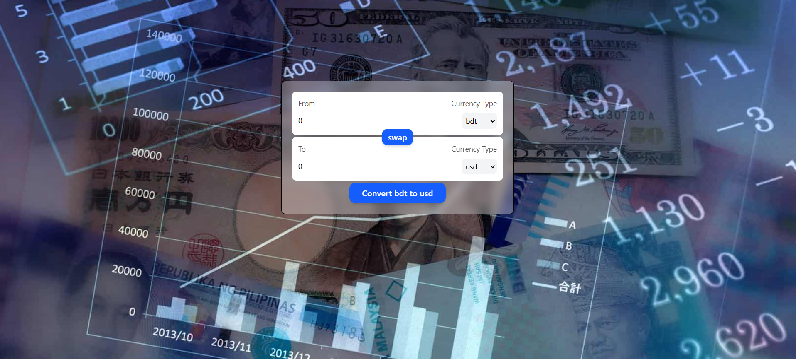

# Currency Converter React App

A simple React-based currency converter app with dynamic currency selection and live conversion using custom hooks and reusable components.

---

## Table of Contents

- [Overview](#overview)
- [Features](#features)
- [Technologies Used](#technologies-used)
- [Setup & Installation](#setup--installation)
- [Usage](#usage)
- [Project Structure](#project-structure)
- [Customization](#customization)
- [Contributing](#contributing)
- [License](#license)

---

## Overview

This project is a responsive currency converter built with React and Tailwind CSS. It allows users to select a "From" and "To" currency, enter an amount, and convert between currencies based on live rates fetched via a custom hook.

The app also includes a handy **swap** button that switches the "From" and "To" currencies instantly.

---

## Features

- Dynamic currency list fetched via `useCurrencyInfo` hook
- Real-time currency conversion
- Swap button to quickly switch currencies and amounts
- Responsive UI with Tailwind CSS styling
- Controlled form inputs with React state
- Form submission handling with prevention of default behavior

---

## 📸 Preview



---

## Technologies Used

- React (with hooks)
- Tailwind CSS for styling
- Custom React hooks (`useCurrencyInfo`) for data fetching
- Functional components with props and event handlers

---

## Setup & Installation

1. **Clone the repository**

   ```bash
   git clone https://github.com/yourusername/currency-converter-react.git
   cd currency-converter-react
   ```

2. **Install dependencies**

  ```bash
  npm install
  ```

3. **Start the development server**

  ```bash
  npm run dev
  ```
